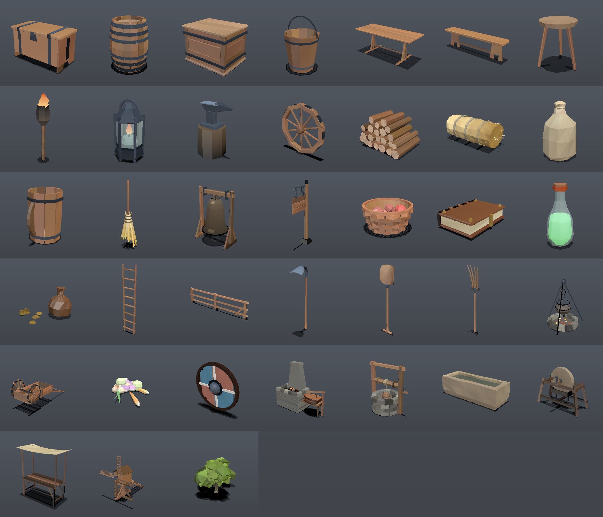

# medieval-kit

A lowpoly medieval model library for [Vibe3D](https://github.com/vibe-stack/vibe3d),
plus the viewer used to build it.

Vibe3D is a source-first model registry for Three.js: you install the
TypeScript that *generates* a model into your own project rather than depending
on an opaque package. This repository holds one such registry.

- **[`my-registry/`](my-registry/)**: the `@medieval-kit` registry, on npm as
  [`@medieval-kit/registry`](https://www.npmjs.com/package/@medieval-kit/registry).
- **`src/`**: a demo app that installs from both `@medieval-kit` and the
  first-party `@scifi-kit`, so the two can be inspected side by side.

**[Open the viewer →](https://medieval.crt.fyi/)**. Every model in the kit:
turn it over, pull its sliders, press play. No install, no sign-in.


37 models and one shared library, **39,518 triangles** for the whole kit. That
is less than a single medium-detail character. Every one of them is procedural
source that lands in your project for you to edit.

That picture is a real scene, not a montage: the viewer's `kit` entry builds
every model at once on a common ground plane, which is where inconsistencies in
scale and tone have nowhere left to hide. Individually:



## Run the viewer

Requires [Bun](https://bun.sh). The viewer runs on WebGPU where the browser has
it and falls back to three's own WebGL2 backend where it does not, including
for `@scifi-kit`'s TSL node materials, which compile on both paths. Only the
separate demo app at `/` insists on WebGPU.

```sh
bun install
bun run registry:build
bun run dev
```

Open `/viewer.html` for the model inspector: registry-grouped catalogue, live
triangle counts, configuration sliders wired to `configure()`, a wireframe
overlay, and per-model GLB download.

## Use the kit in your own project

```sh
bunx vibe3d init
bun add three
bun add -d @types/three
```

`init` writes `models.json` and seeds `@medieval-kit` into it alongside
`@scifi-kit`, so there is nothing to add by hand. That is upstream as of
[vibe-stack/vibe3d#11](https://github.com/vibe-stack/vibe3d/pull/11); on an
older CLI, put the registry in the `registries` object yourself, because
`vibe3d add` resolves the namespace through that map and stops without it:

```json
"@medieval-kit": { "source": "npm:@medieval-kit/registry", "version": "latest" }
```

Then take one model, or the lot:

```sh
bunx vibe3d add @medieval-kit/wooden-barrel
bunx vibe3d add @medieval-kit
```

See [`my-registry/README.md`](my-registry/README.md) for the model list, the
`tsconfig.json` the installed source needs, the configuration fields and the
runtime contract.

## Export to GLB

```sh
bun run export:glb                       # every model into glb/
bun scripts/export-glb.ts --one wooden-chest
```

The viewer's download button and this command share one implementation
(`src/glb.ts`), so they produce byte-identical files. Colour travels as
`COLOR_0` vertex data and `baseColorFactor` stays white. The files carry no
textures at all.

## Verify

```sh
bun run typecheck
bun run verify        # geometry, protocol, metadata, actions
bun run verify:glb    # export every model, read it back, compare
bun run check:docs    # the three READMEs against the kit they describe
bun run render        # renders/_sheet.png, to actually look at the models
```

`verify` runs 1,044 browser-free checks against the installed sources: geometry
validity, winding, coplanar-face (z-fighting) detection, bounding-box limits,
stable root and anchor identity across `configure()`, deterministic seeding,
material ownership, idempotent disposal, action semantics, and agreement
between each model and its published metadata.

Five of those deserve a note, because each was written after a real bug:

- **Winding** is checked three ways, because no single measure is sufficient.
  Bodies of revolution use radial alignment: every radial face on the outer
  shell must point away from the axis, measured in height bands. Closed solids
  use signed volume: `Σ a·(b×c)/6` is positive only when the winding faces
  outward. And edge balance catches a *single* flipped face, which signed volume
  misses. Flipping one face took the volume from 0.058 to 0.039, still
  positive.
- **Z-fighting** is checked by looking for triangles that share a plane, share a
  normal direction, and overlap in area. Edge contact between neighbouring boards
  is fine and is not flagged; genuine coplanar overlap is.
- **Metadata agreement** verifies that every declared control key is a real
  config field, that declared part names match the model's actual parts, and,
  most importantly, that no mesh uses an *undeclared* material slot. A missing
  declaration is a material the consumer cannot reach through
  `materials.override()`. This check found real drift in four models the day it
  was added: a `steel` slot had been used but never declared.
- **Frame-rate independence** for animated models: the same elapsed time is
  stepped at two different frame rates and the results must agree. A naive lerp
  fails this.
- **Nothing floats.** Every check above asks about surfaces, and none of them
  can see a piece of a model hanging in the air with nothing under it. A chest
  lid separated from its chest passed all of them. `scripts/support.ts`
  voxelises the model, finds the connected components of occupied space, and
  requires each one to reach the floor. `scripts/audit.ts` runs that across the
  default, both slider extremes, both ends of a sweep, every action and the
  midpoint of a morph, because a variation must not break what the default gets
  right. It began at 22 failing cases: the bell and the sign had no supporting
  structure at all, the lantern was in four pieces, and the ladder's rungs were
  sized by a formula that disagreed with where its rails actually were.

Every check was mutation-tested: sabotage the code, confirm the check fails,
restore, confirm it passes. A passing test is not evidence that it works.

All of it runs in CI on every push, headless, no browser and no GPU, in about a
minute. The contact sheet is uploaded with the run, because the geometry
checks cannot say "this does not look like a shovel" and the picture is what
makes that reviewable.

`render` closed the one gap all of the above left open. Every check was
*geometric*: triangle counts, winding, coplanarity, bounds. All of them caught
real bugs, and none of them could say "this shovel does not look like a shovel."
The renderer is a small software rasteriser: no browser, no GPU. The shovel was
rewritten a fourth time, the hoe a third and the hay bale a second because of
what those PNGs showed.

## Showcase

The viewer can play itself. A tour orbits the whole catalogue on one continuous
camera move, morphing each model's parameters as it goes, with the interface
hidden so the frame is clean enough to record.

```text
viewer.html?showcase=60      # 30, 60 and 90 are offered
```

**60 s is the default**, and the reason is arithmetic: the tour splits its
running time equally between the models, so across 37 of them a 30 s run gives
each 0.81 seconds, which is a flyby rather than a demonstration. 60 s gives
1.6 s and 90 s gives 2.4 s.

That first number moves every time a model is added, which is worth saying out
loud rather than leaving as a stale sentence in a README: at 27 models, 60 s
was a comfortable 2.2 s each. It is now 1.7 s, and 90 s is there for anyone who
wants the older pace back.

Two things make the variation visible rather than merely present. Continuous
controls travel the whole usable band every beat instead of two random draws
inside it. And every beat is split in half so that the *integer* controls,
stave count, plank count, spokes, rows and tines, can change at the midpoint,
where the same dip that hides a model swap hides the rebuild. Those are the
parameters a viewer actually notices, and morphing cannot interpolate them,
so before the split they were pinned for the whole beat and the tour looked
static.

## The market square

The tour above shows the models one at a time. The other way to show a kit is
to build the place it is for, and let a camera walk through it.

```sh
bun scripts/flythrough.ts --plan                  # the layout from above
bun scripts/flythrough.ts --still 0.35            # one frame, to look at
bun scripts/flythrough.ts --seconds 24 --fps 30   # the sequence, into frames/
```

`scripts/square.ts` is the layout: every model in the kit, most of them several
times, authored rather than packed. Four stalls in a row with goods on their
counters, crates stacked at their feet and what would not fit spilling into the
walk; a forge with its anvil, grindstone and log pile; a tavern with two tables
laid; a cart loaded; the mill behind all of it. Anything with an action is
switched on first, so the sails turn, the forge burns and the sign swings while
the camera moves.

Two things make that possible rather than tedious. `around()` places goods in
the axes of whatever they belong to, so "a basket 0.54 to the right of the
middle of the counter" survives the stall being turned another ten degrees;
without it nobody edits four world coordinates by hand twice, and what they do
instead is leave the counter bare, which is exactly how the first pass came
out. And the surface heights are MEASURED off the models rather than guessed:
a stall counter is 0.781, a table 0.68, a cart bed 0.402, a crate lid 0.52.
Guessing is how a basket ends up hovering a centimetre above a stall, and at
this scale a centimetre is visible.

`scripts/scenery.ts` is the part the kit does not contain, and it is kept in
its own file so the line stays visible. The first cut had none of it, and that
was the whole problem with it: every object stood in its own patch of the same
grey the sky was, so nothing was standing on anything, and the fences enclosed
nothing because a single 2.7 m rail alone in the open encloses nothing.

The floor is the half of that worth keeping, and the released video uses only
the floor. Nobody looks at ground and thinks it came out of the package, but
they will think that about a house, and a video that ends in
`bunx vibe3d add @medieval-kit` has to be a video of what that command
installs. So the boundary is made of the kit's own fence instead, eighteen
2.7 m modules run end to end down both sides and across the back, which costs
some atmosphere and buys back the one claim the video is actually making.

The frontage is still there, eight timber-framed houses behind
`buildHouses()`, for anything that is not selling the kit. `--no-houses` is
what leaves them out, and it is what the released cut passes.

The land is grass with the market worn through it, flat for 18 m so the models
can go on sitting on `y = 0`, then rolling out to hills by 110 m. It is a
polar mesh rather than a grid, because the detail is wanted where the camera
is: a grid fine enough for the square would be a million triangles by the time
it reached the horizon.

Four things that only show up once there is a floor and a horizon, each of
which cost a render to find:

- **The ground has to be drawn before the contact shadows**, or it paints
  straight over every one of them, and it has to be left out of what casts, or
  a plane lying on the floor darkens itself from edge to edge.
- **Its colour has to vary per vertex, not per face.** A flat plane has no
  shading to break up its own grid, so a colour per cell is a chessboard and
  nothing else.
- **Wind the triangles so the normal points up.** Anticlockwise seen from above
  points it down, the back face is culled, and the whole ground silently is not
  there. What shows through is the sky's own horizon band, which looks enough
  like hazy ground to be believed for a while.
- **Never write terrain height as a function of the radius.** It comes out as
  rings centred on wherever the middle is, and rings on a landscape read as a
  target painted on it. Waves in x and z instead.

`scripts/raster.ts` grew the rig for it, all of it settable and all of it
defaulted to what it always was, so no picture the kit itself takes moves by a
pixel: `setLighting` for a low warm sun and a cool ambient, `setPointLights` so
the torches and the forge actually light the ground they stand on,
`setFog` for the haze that puts a hill two hundred metres away, and `paintSky`,
which draws a sky rather than a vertical gradient. The gradient is right for a
catalogue cell and wrong the moment there is a horizon in the frame, because
the band that should be brightest is wherever the ground ends, and on a moving
camera that is a different row every frame.

The camera runs on two splines, one for where it is and one for what it is
looking at, because a camera that only looks along its own path can never show
what it is passing. It comes in at standing height, crosses the square, then
climbs and pulls back so the mill has room to be seven metres tall.

Frames are drawn by the same software rasteriser as the contact sheets, which
is the point: no browser, no GPU, no compositor, no dropped frames, exactly the
resolution asked for, and the same command produces the same file next month.
It renders about 1.5 frames a second at 1080p, so the work is split by frame
range across as many processes as there are cores:

```sh
for k in $(seq 0 11); do
  bun scripts/flythrough.ts --from $((k*60)) --to $((k*60+59)) --out frames &
done; wait
```

Then cut it, at a bitrate high enough to survive being re-encoded by whatever
it gets uploaded to:

```sh
ffmpeg -framerate 30 -i frames/%05d.png -f lavfi -i anullsrc=r=48000:cl=stereo \
  -c:v libx264 -profile:v high -pix_fmt yuv420p \
  -b:v 18M -maxrate 20M -bufsize 36M \
  -c:a aac -b:a 96k -shortest -movflags +faststart square.mp4
```

The silent audio track is deliberate: several players handle an MP4 with no
audio stream at all badly.

## Publish the viewer

```sh
bun run site:build      # → dist-viewer/, ready for any static host
```

The output is the viewer at a domain root: an `index.html`, and a bundle and a
stylesheet it loads by absolute path, both content-hashed so they can be cached
for a year. Nothing is fetched at run time, since the registry address in the
sidebar is a label rather than a request, so there is no API to stand up and nothing
to 404.

Beside it is `artifact.html`, the same viewer collapsed into one self-contained
file. That is the one to hand to anyone who wants it without a server.

This output is what runs at [medieval.crt.fyi](https://medieval.crt.fyi/),
rebuilt on every push. The social card it links to is built there too, by
`bun run cover:build`, so the model count on the card is counted rather than
typed and cannot fall behind the kit.

## Layout

```text
my-registry/
  models/core/          shared palette, RNG, geometry vocabulary, part slots
  models/<model-id>/    one procedural model per folder
  meta.ts               single source for catalogue metadata
  build.ts              compiles models/ into dist/registry.json
  drafts/               kept in the tree, kept out of the build
src/
  lib/vibe3d/           Vibe3D contracts installed by `vibe3d init`
  models/               installed model source (owned, editable)
  viewer.ts             the model inspector
  glb.ts                GLB export, shared by the viewer and the CLI
  catalog.ts            viewer catalogue, derived from meta.ts
scripts/
  verify-model.ts       browser-free conformance checks
  verify-glb.ts         export/re-import round trip
  zfight.ts             coplanar overlap detection
  support.ts            voxel connectivity: nothing may float
  audit.ts              runs the support check across every configuration
  raster.ts             the software renderer: triangles in, PNG out
  render.ts             its command line: sheets, sweeps, turntables
  text.ts               a TrueType reader, so the renderer can set type
  build-cover.ts        the social card, with its numbers counted not typed
  check-docs.ts         documented counts against the models themselves
  reference-shots.ts    one photographic reference per model, for comparison
  catalog-table.ts      regenerates the model table in the registry README
  export-glb.ts         batch GLB export
media/
  kit.png               the whole catalogue as one scene
  models.png            the contact sheet, one cell per model
  cover.png             the card a shared link shows; built, not drawn
  fonts/                Archivo and IBM Plex Mono, under the OFL
models.json             which registries this project resolves
models.lock.json        install receipt; `vibe3d diff` compares against it
```

`src/models/` is generated by `vibe3d add` but committed on purpose: it is the
demo's own source, and keeping it in the tree is what makes `vibe3d diff`
meaningful.

Released under the MIT License.
