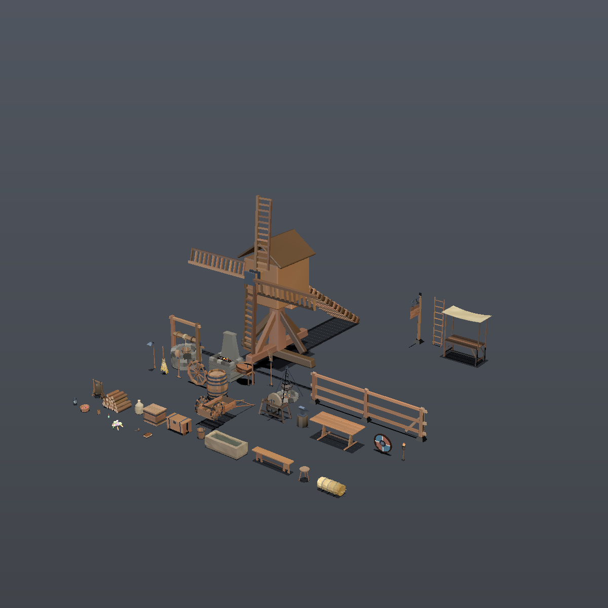

# medieval-kit

A lowpoly medieval model library for [Vibe3D](https://github.com/vibe-stack/vibe3d),
plus the viewer used to build it.

Vibe3D is a source-first model registry for Three.js: you install the
TypeScript that *generates* a model into your own project rather than depending
on an opaque package. This repository holds one such registry.

- **[`my-registry/`](my-registry/)** — the `@medieval-kit` registry, published
  to npm as [`@medieval-kit/registry`](my-registry/README.md).
- **`src/`** — a demo app that installs from both `@medieval-kit` and the
  first-party `@scifi-kit`, so the two can be inspected side by side.



35 models and one shared library, **31,404 triangles** for the whole kit — less
than a single medium-detail character. Every one is procedural source you own
and edit, not an asset you load.

## Run the viewer

Requires [Bun](https://bun.sh) and a browser with WebGPU (the `@scifi-kit` model
in the demo uses TSL node materials; the medieval kit itself does not).

```sh
bun install
bun run registry:build
bun run dev
```

Open `/viewer.html` for the model inspector: registry-grouped catalogue, live
triangle counts, configuration sliders wired to `configure()`, a wireframe
overlay, and per-model GLB download.

## Use the kit in your own project

```sh
bunx vibe3d init
bunx vibe3d add @medieval-kit/wooden-barrel
```

See [`my-registry/README.md`](my-registry/README.md) for the model list,
configuration fields, and runtime contract.

## Export to GLB

```sh
bun run export:glb                       # every model into glb/
bun scripts/export-glb.ts --one wooden-chest
```

The viewer's download button and this command share one implementation
(`src/glb.ts`), so they produce byte-identical files. Colour travels as
`COLOR_0` vertex data and `baseColorFactor` stays white — the files carry no
textures at all.

## Verify

```sh
bun run typecheck
bun run verify        # geometry, protocol, metadata, actions
bun run verify:glb    # export every model, read it back, compare
bun run check:docs    # the three READMEs against the kit they describe
bun run render        # renders/_sheet.png — actually look at the models
```

`verify` runs 1,044 browser-free checks against the installed sources: geometry
validity, winding, coplanar-face (z-fighting) detection, bounding-box limits,
stable root and anchor identity across `configure()`, deterministic seeding,
material ownership, idempotent disposal, action semantics, and agreement
between each model and its published metadata.

Five of those deserve a note, because each was written after a real bug:

- **Winding** is checked three ways, because no single measure is sufficient.
  Bodies of revolution use radial alignment — every radial face on the outer
  shell must point away from the axis, measured in height bands. Closed solids
  use signed volume: `Σ a·(b×c)/6` is positive only when the winding faces
  outward. And edge balance catches a *single* flipped face, which signed volume
  misses — flipping one face took the volume from 0.058 to 0.039, still
  positive.
- **Z-fighting** is checked by looking for triangles that share a plane, share a
  normal direction, and overlap in area. Edge contact between neighbouring boards
  is fine and is not flagged; genuine coplanar overlap is.
- **Metadata agreement** verifies that every declared control key is a real
  config field, that declared part names match the model's actual parts, and —
  most importantly — that no mesh uses an *undeclared* material slot. A missing
  declaration is a material the consumer cannot reach through
  `materials.override()`. This check found real drift in four models the day it
  was added: a `steel` slot had been used but never declared.
- **Frame-rate independence** for animated models: the same elapsed time is
  stepped at two different frame rates and the results must agree. A naive lerp
  fails this.
- **Nothing floats.** Every check above asks about surfaces, and none of them
  can see a piece of a model hanging in the air with nothing under it — a chest
  lid separated from its chest passed all of them. `scripts/support.ts`
  voxelises the model, finds the connected components of occupied space, and
  requires each one to reach the floor. `scripts/audit.ts` runs that across the
  default, both slider extremes, both ends of a sweep, every action and the
  midpoint of a morph, because a variation must not break what the default gets
  right. It began at 22 failing cases: the bell and the sign had no supporting
  structure at all, the lantern was in four pieces, and the ladder's rungs were
  sized by a formula that disagreed with where its rails actually were.

Every check was mutation-tested: sabotage the code, confirm the check fails,
restore, confirm it passes. A passing test is not evidence that it works.

`render` closed the one gap all of the above left open. Every check was
*geometric* — triangle counts, winding, coplanarity, bounds. All of them caught
real bugs, and none of them could say "this shovel does not look like a shovel."
The renderer is a small software rasteriser: no browser, no GPU. The shovel was
rewritten a fourth time, the hoe a third and the hay bale a second because of
what those PNGs showed.

## Showcase

The viewer can play itself. A tour orbits the whole catalogue on one continuous
camera move, morphing each model's parameters as it goes, with the interface
hidden so the frame is clean enough to record.

```text
viewer.html?showcase=60      # 30, 60 and 90 are offered
```

**60 s is the default**, and the reason is arithmetic: the tour splits its
running time equally between the models, so across 35 of them a 30 s run gives
each 0.86 seconds — a flyby, not a demonstration — while 60 s gives 1.7 s and
90 s gives 2.6 s.

That first number moves every time a model is added, which is worth saying out
loud rather than leaving as a stale sentence in a README: at 27 models, 60 s
was a comfortable 2.2 s each. It is now 1.7 s, and 90 s is there for anyone who
wants the older pace back.

Two things make the variation visible rather than merely present. Continuous
controls travel the whole usable band every beat instead of two random draws
inside it. And every beat is split in half so that the *integer* controls —
stave count, plank count, spokes, rows, tines — can change at the midpoint,
where the same dip that hides a model swap hides the rebuild. Those are the
parameters a viewer actually notices, and morphing cannot interpolate them,
so before the split they were pinned for the whole beat and the tour looked
static.

## Layout

```text
my-registry/
  models/core/          shared palette, RNG, geometry vocabulary, part slots
  models/<model-id>/    one procedural model per folder
  meta.ts               single source for catalogue metadata
  build.ts              compiles models/ into dist/registry.json
  drafts/               kept in the tree, kept out of the build
src/
  lib/vibe3d/           Vibe3D contracts installed by `vibe3d init`
  models/               installed model source (owned, editable)
  viewer.ts             the model inspector
  glb.ts                GLB export, shared by the viewer and the CLI
  catalog.ts            viewer catalogue, derived from meta.ts
scripts/
  verify-model.ts       browser-free conformance checks
  verify-glb.ts         export/re-import round trip
  zfight.ts             coplanar overlap detection
  support.ts            voxel connectivity — nothing may float
  audit.ts              runs the support check across every configuration
  render.ts             offline software rasteriser → PNG contact sheet
  check-docs.ts         documented counts against the models themselves
  reference-shots.ts    one photographic reference per model, for comparison
  probe-tree.ts         measures the oak against its reference photographs
  catalog-table.ts      regenerates the model table in the registry README
  export-glb.ts         batch GLB export
media/                  images used by this README
models.json             which registries this project resolves
models.lock.json        install receipt; `vibe3d diff` compares against it
```

`src/models/` is generated by `vibe3d add` but committed on purpose: it is the
demo's own source, and keeping it in the tree is what makes `vibe3d diff`
meaningful.

Released under the MIT License.
